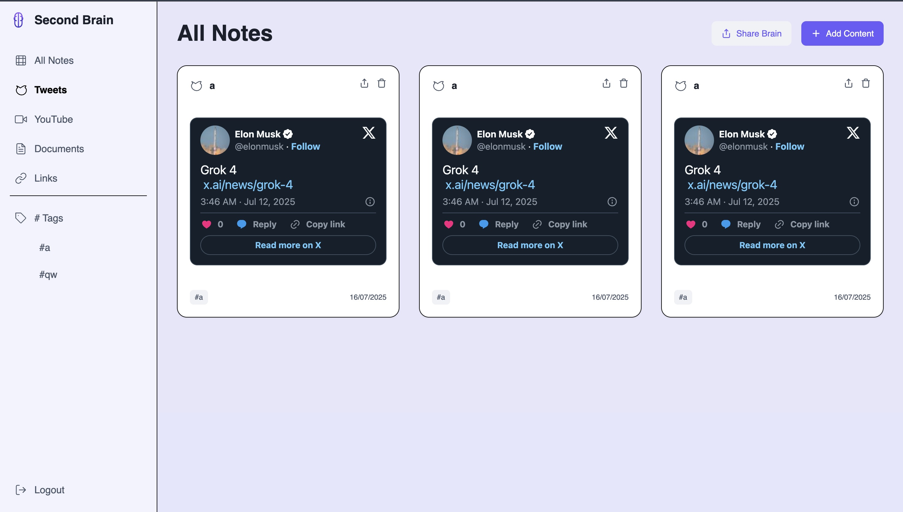

# Nexus: The Digital Second Brain

<p align="center">
  <a href="https://nexus-the-digital-second-brain.vercel.app/" target="_blank">
    
  </a>
</p>



**Nexus** is a modern, full-stack MERN application designed to be your "Second Brain"—a digital space to capture, organize, and rediscover your most important information. From tweets and YouTube videos to personal documents and links, Nexus provides an intelligent and beautiful interface to manage your digital life.

This project is built with a focus on a professional, industry-level user experience, featuring a dynamic, animated UI, robust backend services, and a seamless deployment pipeline.

---

### ✨ Key Features

* **Multi-Content Organization:** Save and categorize different types of content, including Tweets, YouTube videos, documents, and external links.
* **Dynamic Content Embedding:** Automatically embeds playable YouTube videos and interactive tweets directly into content cards for a rich user experience.
* **Intelligent Filtering & Tagging:** Organize your notes with custom tags and filter your dashboard view by content type or by specific tags.
* **Secure Authentication:** A complete user authentication system with JWT-based sign-up and sign-in flows.
* **Cloud Deployed:** Fully deployed with a professional MERN stack workflow (Vercel, Render, MongoDB Atlas).
* **Modern, Animated UI:** Built with Framer Motion, the UI features fluid animations, a 3D interactive login screen, and a polished design system created with Tailwind CSS.
* **Sharing Functionality:** Generate unique, shareable links to your entire "brain" to showcase your curated content.

---

### 🚀 Tech Stack

The application is built using the MERN stack with a modern, type-safe toolchain.

**Frontend:**
<p>
  
  
  
  
  
  
</p>

**Backend:**
<p>
  
  
  
  
  
</p>

---

### 🏁 Getting Started

To get a local copy up and running, follow these simple steps.

#### **Prerequisites**

* Node.js (v18 or later recommended)
* npm or yarn
* A local MongoDB instance (or a free MongoDB Atlas account)

#### **Installation & Setup**

1.  **Clone the repository:**
    ```sh
    git clone [https://github.com/SHAHZEB28/Nexus-The_Digital_Second_Brain.git](https://github.com/SHAHZEB28/Nexus-The_Digital_Second_Brain.git)
    cd Nexus-The_Digital_Second_Brain
    ```

2.  **Setup the Backend:**
    * Navigate to the backend directory: `cd Brainlybackend`
    * Install dependencies: `npm install`
    * Create a `.env` file and add your `DATABASE_URL` and `JWT_PASSWORD`.
    * Start the server: `npm run dev`
    * The backend will be running on `http://localhost:3000`.

3.  **Setup the Frontend:**
    * Navigate to the frontend directory: `cd ../Brainlyfrontend`
    * Install dependencies: `npm install`
    * Start the development server: `npm run dev`
    * Open your browser and go to `http://localhost:5173` (or whatever port is specified).

---

### 🌐 Deployment

This project is configured for a seamless deployment experience:
* The **backend** is ready to be deployed as a Web Service on **Render**.
* The **frontend** is optimized for deployment on **Vercel**, with a `vercel.json` file for proxying API requests.
